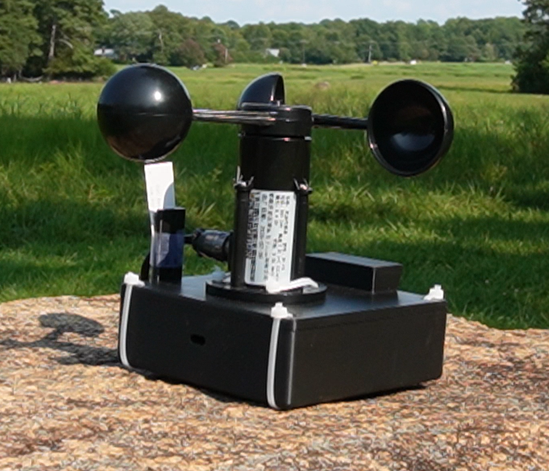
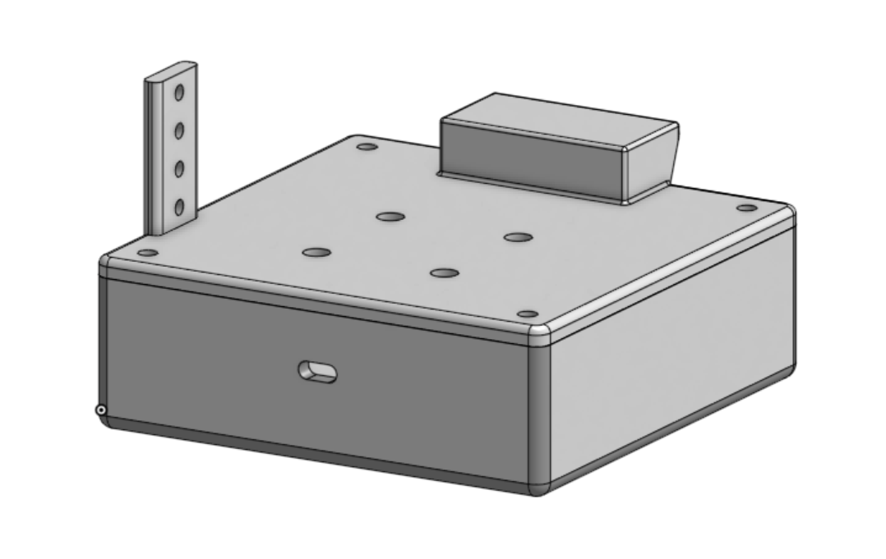

This is my LTE Weather Station Project. Its body was custom 3D-designed, and a Lilygo T7000G microcontroller, a type of ESP32 board with a SIM card slot, powers it. The LilyGo uses a Hologram SIM card and an LTE antenna to connect to the internet and send data. First, the data goes to a Twilio worker, which triggers a serverless function that forwards it to a database for display on the front end of a Next.js web app (chapelhillweather.com). After completing the project, I ran a 1-week trial with the station in a remote open area with cell coverage; it relayed real-time weather data in 30-minute increments for a full week, and all the data collected in the trial is now displayed on this website, as shown above.

